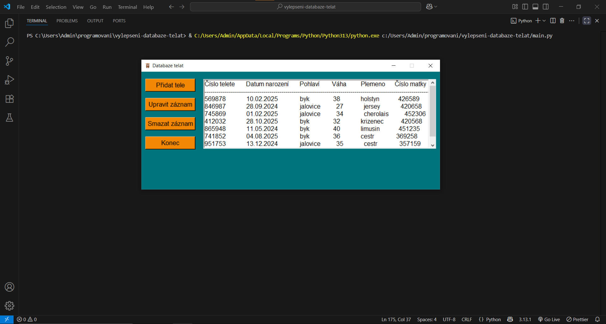

# Vylepšená databáze telat

Python aplikace s Tkinterem slouží jako databáze telat.

---

Součástí repozitáře je:
- ikona krávy (ikona_krava.ico), která je použita jako ikona okna aplikace
- ukázkový soubor (telata.csv), který aplikace sama vytváří a do kterého ukládá data

---

Funkce:
- Přidání nového telete
- Úprava existujícího záznamu
- Smazání zvířete z databáze
- Zobrazení všech zvířat a detailní zobrazení se vypisuje automaticky v úvodním okně
- Automatické ukládání dat do telata.csv, soubor se sám vytvoří

---

Použité technologie a metody:
- Tkinter – pro tvorbu GUI (okna, tlačítka, vstupní pole, seznam)
- csv modul – pro práci se soubory CSV (čtení, zápis, přepis dat)
- os modul – pro kontrolu existence a velikosti souboru
- Listbox + Scrollbar pro zobrazení více záznamů s možností rolování
- Použití try/except pro ošetření chyb při práci se soubory

---

Ukázka:
[Úvodní okno](screenshots/foto1.png)  
Úvodní okno
 
Přidat zvíře

Upravit zvíře

